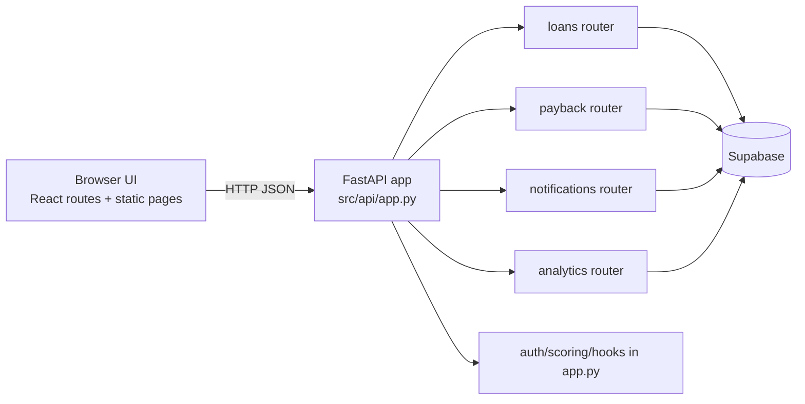

# Architecture

## Overview

Peer Lend is a monorepo-style project that combines:

- A FastAPI backend for lending, repayment, notifications, and analytics endpoints.
- Lightweight frontend route components under `src/routes` for borrower/lender UI flows.
- Brand-facing static pages for Pulse and Ancla experiences.
- Supabase as the current operational datastore integration point.

This branch (`Peer_Lending_Pulse`) appears to be an MVP scaffold with working API surfaces and partial frontend wiring.

## High-Level Component Map

## Repository Layout

- `main.py`: ASGI entrypoint re-exporting the API app (`from src.api import app`).
- `src/api/`: Backend HTTP layer (FastAPI app, routers, Supabase client bootstrap, run script).
- `src/services/`: Domain service stubs (for example scoring service placeholder).
- `src/models/`: Domain models (currently minimal scaffold).
- `src/routes/`: Frontend route components for apply/account/status/analytics/repayment views.
- `db/`: SQL schema and migration placeholders.
- `config/`: Settings and schema placeholders.
- `docs/`: API and architecture documentation.
- `Pulse/`, `Ancla/`, root `index.html` and `landing_page.html`: static web entry points and brand pages.

## Backend Architecture

### Application Composition

The FastAPI app is assembled in `src/api/app.py`:

- Creates `FastAPI(title="Peer Lending API", version="1.0.0")`.
- Defines local request/response models for auth, scoring, payback status, integration hooks.
- Registers feature routers:
	- `src.api.payback`
	- `src.api.loans`
	- `src.api.notifications`
	- `src.api.analytics`

### API Surface (Current)

Core endpoints currently in app-level module:

- `POST /api/v1/auth/login`
- `POST /api/v1/auth/signup`
- `POST /api/v1/scoring`
- `POST /api/v1/payback_status`
- `POST /api/v1/integration_hooks`

Router-backed endpoints:

- Loans (`src/api/loans.py`)
	- `GET /api/v1/loans`
	- `POST /api/v1/loans/{loan_id}/approve`
	- `POST /api/v1/loans/{loan_id}/deny`
- Repayments (`src/api/payback.py`)
	- `POST /api/v1/schedule`
	- `POST /api/v1/payback/schedule` (legacy alias)
	- `GET /api/v1/repayments`
- Notifications (`src/api/notifications.py`)
	- `GET /api/v1/notifications`
- Analytics (`src/api/analytics.py`)
	- `GET /api/v1/analytics`

### Data Access Pattern

All operational reads/writes in routers currently go through a shared Supabase client:

- `src/api/supabase.py` loads `.env` from repo root and app directory.
- Requires `SUPABASE_URL` and `SUPABASE_SERVICE_KEY` on startup.
- Uses table-centric operations (for example `supabase.table("loans")...`).

## Frontend/UI Architecture

`src/routes/` provides route-level React components that fetch API data directly from the backend base URL.

Current route coverage includes:

- Borrower application flow (`apply.tsx`)
- Repayment panel (`repayment.tsx`)
- Notifications feed (`notifications.tsx`)
- Analytics dashboards using Recharts (`Analytics.tsx`)
- Simple navigation landing (`index.tsx`)

In parallel, static brand pages (`index.html`, `landing_page.html`, `Ancla/index.html`) provide non-SPA entry experiences.

## Runtime and Tooling

- Python: `>=3.11,<3.13`
- Dependency/tooling manager: Poetry (`pyproject.toml`)
- API server: Uvicorn + FastAPI
- Key libraries: `supabase`, `python-dotenv`, `pydantic`, `streamlit`, `pandas`, `numpy`
- Developer script: `poetry run start` -> `src.api.scripts:start`

`docker-compose.yaml` currently contains only a minimal API service image declaration (`python:3.11-slim`) and is not yet a complete production compose setup.

## Data and Configuration Assets

- `config/settings.yaml` currently contains only `app_name`.
- `db/schema.sql` is a placeholder.
- `db/migrations/init.sql` exists for initial migration scaffolding.

This indicates the authoritative runtime data model is currently represented by Supabase tables and API assumptions, rather than checked-in SQL schema definitions.

## Known Gaps and Inconsistencies

1. Several files are intentionally scaffold-level placeholders (for example scoring service, tests, schema).
2. Frontend API base URLs are inconsistent across routes (`8000` vs `8001` in current files).
3. Some frontend payload fields do not yet match backend request models exactly (for example scoring payload shape in `apply.tsx` vs backend schema in `app.py`).
4. Error handling and validation are minimal and mostly endpoint-local.
5. There is no documented production deployment topology yet (single-node API assumed).

## Current Architecture Maturity

The project is best described as a functional API-first MVP skeleton:

- Implemented: core endpoint scaffolding, Supabase integration, basic dashboard routes.
- Partially implemented: domain services, tests, database schema ownership in-repo.
- Pending for production readiness: unified data contracts, robust persistence schema migration flow, observability, auth hardening, and deployment definition.
